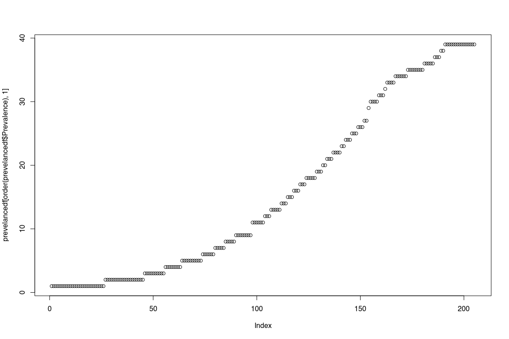
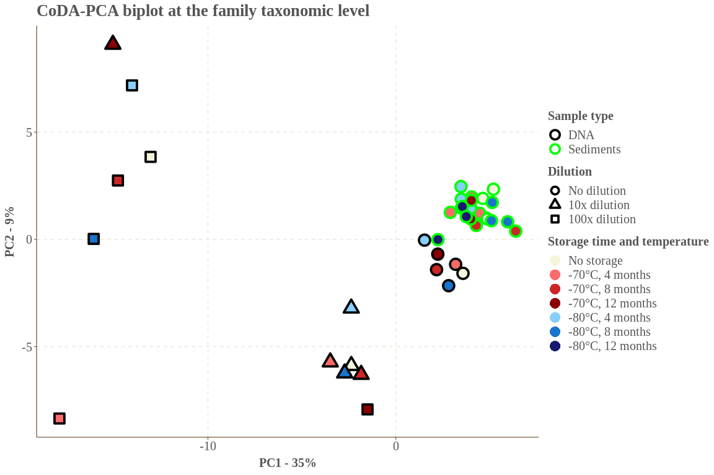

CoDA analysis
================
Sven Le Moine Bauer
2023-03-27

## Introduction

The following R code will describe the analysis leading to the making of
Figure 3A.

## Loading and preparing the data.

Let’s start by loading the libraries and set up the working directory

``` r
library(phyloseq) # To play around with OTU tables
library(ggplot2) # To plot
library(ggthemr) # Pimping the plot
library(compositions) # Clr trasnformation
library(vegan) # Permanova test

# Set directory to the directory of the script
setwd(dirname(rstudioapi::getActiveDocumentContext()$path))
```

The following function is also needed for the PCA.

``` r
######## FUNCTION mBiplext ####################
# Compositional biplot, colored by population,
# with additional real variables incorporated.
# Programmed by J.J. Egozcue (2020) based on
# previous function mBPPOP (Dec. 2014)
##### draws a CoDa-biplot with data coming from
# populations coded by a number xpop indicating
# color from a color sequence in colist.
# carries out clr of data set.
# centres the clr and the additional real variables
# in extr. Then they are added to the centered clr.
# carries out svd of centred clr and added real
# extra variables in extr
# plots biplot with data colored by xpop (number of color)
##### input:
# x compositional data by rows (matrix)
# xpop factor indicating the population of each row in x
# extr a vector or a matrix of real variables to be added
#    to the biplot.
# namextr name of a variable (only for single variable added)
# biscale    = 1 covariance biplot
#            = 0 form biplot
# circ       = FALSE (default) ; TRUE plots a unit circle
#              in form biplots
# punch      = 0 do not plot data points
#            = 1 plot symbols for data points
#              following pchpoint
#            = 2 plot numbers for data points following
#              pchpoints
#            = 3 lines between consecutive data points
#              are drawn
# choice[1:2] = PC's to be plotted, eg c(1,2), c(1,3)...
# colist a color sequence for populations.
# pchpoint integer sequence determining the plot pch symbol
#     of each point; when punch=2 is the number to be plotted.
# optpdf = 1  prints on pdf
# filename (optional) defines the name of the output pdf file.
#         by default formBPPOP.pdf or covBPPOP.pdf are used
#### output: a list containing
# the svd matrices: U, V, and singular values in D
# explained variance in the biplot explvar
# additionally
# a pdf file containing the biplot is printed in working dir.
###################################################

mBiplext <- function(x,xpop=NULL,extr=NULL,choice=c(1,2),
                     biscale=1,punch=1,colist=1:10,
                     circ=FALSE,colcirc="grey70",
                     optpdf=0,filename=NULL,
                     namextr=c("tot"),
                     colray="red",colextr="darkgreen",
                     cextext=1,lwdray=1,pchpoint=1){
  # point colors
  colpoint = rep(1,length(colist))
  if(!is.null(xpop)){
    colpoint = colist
  }
  # clr of x
  logx=log(x)
  xclr = logx - outer(rowMeans(logx),rep(1,length=ncol(logx)))
  # centring xclr
  cxclr = xclr - outer(rep(1,nrow(xclr)), colMeans(xclr))  
  # centering real variables extr, if any
  extrue=FALSE
  nextr=NULL
  if(!is.null(extr)){
    if(is.vector(extr)){
      cextr = extr - mean(extr)
      mextr = matrix(cextr,nrow=length(extr),ncol=1)
      colnames(mextr)=namextr
      nextr=1
      extrue = TRUE
    }
    if(is.matrix(extr)){
      namextr = colnames(extr)
      mextr = extr-outer(rep(1,nrow(extr)),colMeans(extr))
      nextr=ncol(mextr) }
    # append real variables in extr  
    cxclr1= cbind(cxclr,mextr)
    colnames(cxclr1)=c(colnames(xclr),namextr)
    cxclr=cxclr1
    extrue = TRUE
  }
  # svd (cxclr)
  SVDxclr = svd(cxclr)
  U = SVDxclr$u
  V = SVDxclr$v
  rownames(V)=colnames(cxclr)
  D = SVDxclr$d
  # scores and loadings
  ## covariance biplot
  if(biscale==1){
    ld=t(diag(D)%*%t(V))/sqrt(nrow(cxclr))
    mainT="covariance biplot"
    fileT="covBiplext"
    mld=max(abs(ld[,choice]))
    msc=max(abs(U[,choice]))
    sc=U *(mld/msc)  # scaling scores
    xylimit=c(-mld,mld)
  }
  
  ## form biplot
  ## scaling: unit norm of V-vectors
  if(biscale==0){
    sc=U%*%diag(D)
    ld=V
    mainT="form biplot"
    fileT="formBiplext"
    mld = max(abs(ld[,choice]))     # scaling basis vectors
    msc = max(abs(sc[,choice]))
    sc = sc*(mld/msc)
    xylimit = c(-mld,mld)
  }
  
  # numeric output
  variances = D^2
  totvar=sum(variances)/(nrow(x)-1)
  extrvar=0
  if(extrue==TRUE){
    extrvar = var(extr) }
  explvar = (variances[choice[1]]+variances[choice[2]])/sum(variances)
  # names
  #  clrnames=paste("clr.",colnames(x),sep="")
  clrnames=colnames(cxclr)
  if(choice[1] == 1){
    expl=100*variances[choice[1]]/sum(variances)
    xlabel=paste("first axis,", " var% ",format(expl,nsmall=1,digits=3),sep="")}
  if(choice[1] == 2){
    expl=100*variances[choice[1]]/sum(variances)
    xlabel=paste("second axis,", " var% ",format(expl,nsmall=1,digits=3),sep="")}
  if(choice[1] == 3){
    expl=100*variances[choice[1]]/sum(variances)
    xlabel=paste("third axis,", " var% ",format(expl,nsmall=1,digits=3),sep="")}
  if(choice[1] >= 4){
    expl=100*variances[choice[1]]/sum(variances)
    xlabel=paste(paste(choice[1],"th axis",sep=""), " var% ",format(expl,nsmall=1,digits=3),sep="")}
  if(choice[2] == 1){
    expl=100*variances[choice[2]]/sum(variances)
    ylabel=paste("first axis,"," var% ",format(expl,nsmall=1,digits=3),sep="")}
  if(choice[2] == 2){
    expl=100*variances[choice[2]]/sum(variances)
    ylabel=paste("second axis,"," var% ",format(expl,nsmall=1,digits=3),sep="")}
  if(choice[2] == 3){
    expl=100*variances[choice[2]]/sum(variances)
    ylabel=paste("third axis,"," var% ",format(expl,nsmall=1,digits=3),sep="")}
  if(choice[2] >= 4){
    expl=100*variances[choice[2]]/sum(variances)
    ylabel=paste(paste(choice[2],"th axis",sep=""), " var% ",format(expl,nsmall=1,digits=3),sep="")}
  
  if(punch==0){pun="n"}
  if(punch==1){pun="p"}
  if(punch==2){pun="n"}
  if(punch==3){pun="b"}
  
  # pdf output
  filenam=paste(fileT,".pdf",sep="")
  if(optpdf==1){
    if(is.null(filename)==FALSE){filenam=filename}
    pdf(filenam, width=5, height=5, fam="Times")}
  
  plot(sc[,choice],col=colist,type=pun,cex=0.8,asp=1,
       xlim=xylimit,ylim=xylimit,main=mainT,
       xlab=xlabel,ylab=ylabel,pch=pchpoint)
  # only form biplot: unit circle on variables
  if(circ==TRUE & biscale==0){
    theta = seq(from=0, to=(2*pi),length=150)
    xc=cos(theta)
    yc=sin(theta)
    lines(xc,yc,col="grey70")
  }
  
  #  this is for changing punch in place of color
  #  plot(sc[,choice],col="black",type=pun,cex=0.8,asp=1,
  #       pch=colpoint,
  #       xlim=xylimit,ylim=xylimit,main=mainT,
  #       xlab=xlabel,ylab=ylabel)
  
  if(punch==2){
    #    text(sc[,choice],labels=(1:nrow(sc)),col=colpoint,cex=0.8)       
    text(sc[,choice],labels=pchpoint,col=colpoint,cex=0.8)
  }
  for(i in 1:ncol(x)){
    xx=rbind(c(0,0),ld[i,choice])
    lines(xx, col=colray,lwd=lwdray)
    xtext = ld[i,choice[1]]
    ytext = ld[i,choice[2]]
    text(xtext,ytext,labels=clrnames[i],col=colray,
         pos=2,offset=0.3,cex=cextext)
  }
  if(!is.null(nextr)){
    for(iex in 1:nextr){
      nnrow = ncol(x)+iex
      xxetr = rbind(c(0,0),ld[nnrow,choice])
      lines(xxetr,col=colextr,lwd=lwdray)
      xtextr = ld[nnrow,choice[1]]
      ytextr = ld[nnrow,choice[2]]
      text(xtextr,ytextr,labels=clrnames[nnrow],col=colextr,
           pos=2,offset=0.3,cex=cextext)
    } }
  
  if(optpdf==1){
    dev.off()
  }
  lout = list("U"=U,"V"=V,"D"=D,"explvar"=explvar,"totvar"=totvar,
              "extrvar"=extrvar)
  return(lout)
}
```

Now let’s load the data.

``` r
OTUtable <- read.csv("Otutab.sorted.tsv", row.names=1, sep = "\t")
taxtable <- read.csv("assignments.csv", row.names = 1, sep = "\t")
Metatable <- read.csv("Metadata.csv", row.names = 1, sep = ",")
```

We need to make a couple of changes to the taxonomy table, namely
changing the Class Proteobacteria to Pseudomonadata, and also filling
the empty cells with “Unclassified_XXX”.

``` r
taxtable$Class[taxtable$Class == 'Proteobacteria'] <- 'Pseudomonadata'

for (i in 1:nrow(taxtable)){taxtable[i,] <- as.character(taxtable[i,])}
for (i in 1:nrow(taxtable)){
  if (taxtable[i,2] == ""){
    phylum <- paste("Unclassified_", taxtable[i,1], sep = "")
    taxtable[i, 2:7] <- phylum
  } else if (taxtable[i,3] == ""){
    class <- paste("Unclassified_", taxtable[i,2], sep = "")
    taxtable[i, 3:7] <- class
  } else if (taxtable[i,4] == ""){
    order <- paste("Unclassified_", taxtable[i,3], sep = "")
    taxtable[i, 4:7] <- order
  } else if (taxtable[i,5] == ""){
    family <- paste("Unclassified_", taxtable[i,4], sep = "")
    taxtable[i, 5:7] <- family
  } else if (taxtable[i,6] == ""){
    genus <- paste("Unclassified_", taxtable[i,5], sep = "")
    taxtable[i, 6:7] <- genus
  } else if (taxtable[i,7] == ""){
    species <- paste("Unclassified_", taxtable[i,6], sep = "")
    taxtable[i, 7] <- species
  }
}
rm(i, class, family, genus, order, phylum, species) # Some cleanup
```

Now we can make our phyloseq objects, remove the samples not needed for
this analysis, and remove the OTUs not assigned to Bacteria or Archaea
at the Domain level.

``` r
#Transform into matrixes the OTU and tax tables (needed for phyloseq)
OTUtable <- as.matrix(OTUtable)
taxtable <- as.matrix(taxtable)

#Make phyloseq objects
OTU = otu_table(OTUtable, taxa_are_rows = TRUE)
TAX = tax_table(taxtable)
samples = sample_data(Metatable)
Dataset <- phyloseq(OTU, TAX, samples)

# Remove the non Bacteria or Archaea
Dataset <- subset_taxa(Dataset, Domain %in% c("Archaea", "Bacteria"))

# Remove the blank, and samples that are used to test for the dispertion analysis (supplementary data).
Dataset <- prune_samples(!(sample_names(Dataset) == 'BLANK'), Dataset)
Dataset <- prune_samples(sample_data(Dataset)$DilutionTest == 'No', Dataset)

# As we removed some samples it is possible that some OTUs are not present at all. Let's remove them.
keepTaxa = taxa_sums(Dataset) > 0
Dataset = prune_taxa(keepTaxa, Dataset)
```

## CoDA-PCA biplot

For this analysis we will pool the OTUs at the family taxonomic level.
This allows to simplify the dataset (only 205 taxa remaining).
Furthermore, we are not really interested in species-level description
here.

``` r
Dataset_family <- tax_glom(Dataset, taxrank = "Family")
Dataset_family
```

    ## phyloseq-class experiment-level object
    ## otu_table()   OTU Table:         [ 205 taxa and 39 samples ]
    ## sample_data() Sample Data:       [ 39 samples by 10 sample variables ]
    ## tax_table()   Taxonomy Table:    [ 205 taxa by 7 taxonomic ranks ]

Then I would like to look into the prevalence of each taxa, and remove
the ones with low prevalence. The rational here is that all samples are
biological replicates, and despite their different storage treatment
they should still exhibit similar taxa in their compositions. Therefore,
families that are present in a very little amount of samples are likely
the results of contamination or technical artifacts, and can therefore
be removed.

``` r
# Let s look at the prevalence of each families.
prevelancedf = apply(X = otu_table(Dataset_family),
                     MARGIN = 1,
                     FUN = function(x){sum(x > 0)})
# Add taxonomy and total read counts to this data.frame
prevelancedf = data.frame(Prevalence = prevelancedf,
                          TotalAbundance = taxa_sums(Dataset_family),
                          tax_table(Dataset_family))
plot(prevelancedf[order(prevelancedf$Prevalence),1])
```

<!-- -->

One could also look at the dataframe instead of the plot. So let’s keep
(arbitrarily) only the taxa that are present in at least 5 samples. We
have now only 132 taxa.

``` r
keepTaxa <- row.names(prevelancedf)[which(prevelancedf$Prevalence>5)]
Dataset_family = prune_taxa(keepTaxa, Dataset_family)
Dataset_family
```

    ## phyloseq-class experiment-level object
    ## otu_table()   OTU Table:         [ 132 taxa and 39 samples ]
    ## sample_data() Sample Data:       [ 39 samples by 10 sample variables ]
    ## tax_table()   Taxonomy Table:    [ 132 taxa by 7 taxonomic ranks ]

Moving on into compositional analysis, we need to get rid of our 0s
(inherent problem to log ratio analyses), which we will do by adding a
pseudocount of 1 to each count.

``` r
# Amount of 0s
OTU_family <- as.data.frame(otu_table(Dataset_family))
mean(unlist(OTU_family) %in% "0") * 100 # 41% of zeros.
```

    ## [1] 40.92852

``` r
# So let s add a pseudocount to every count.
OTU_family_noOs <- OTU_family + 1

# At the same time, let's change the taxa names by their family names
rownames(OTU_family_noOs) <- tax_table(Dataset_family)[,5]
```

Now we can use the mBiplext function. In short, it does a clr
transformation, then centers the data, and runs a singular value
decomposition.

``` r
PCA <- mBiplext(t(OTU_family_noOs), extr = NULL, biscale = 0)
```

``` r
# Variance explained by each PC: 30%, 14%, 9%.
(PCA$D)^2/sum((PCA$D)^2)
```

Now we want to extract the scores for the form biplot. From the SVD,
they are the product of the U matrix and the singular values (diagonal
matrix d). Here I only extract the scores for the 3 first PCs.

``` r
PCA_scores <- as.data.frame(PCA$U%*%diag(PCA$D))[,1:3]
rownames(PCA_scores) <- rownames(sample_data(Dataset_family))
```

Finally let’s add some metadata to the dataframe so that we can make a
nice plot.

``` r
PCA_scores <- PCA_scores[order(match(rownames(PCA_scores), rownames(Metatable))),]
PCA_scores$MONTHS <- as.factor(Metatable$Months[match(row.names(PCA_scores), row.names(Metatable))])
PCA_scores$TEMPERATURE <- as.factor(Metatable$Temperature[match(row.names(PCA_scores), row.names(Metatable))])
PCA_scores$TYPE <- Metatable$Type[match(row.names(PCA_scores), row.names(Metatable))]
PCA_scores$DILUTION <- as.factor(Metatable$Dilution[match(row.names(PCA_scores), row.names(Metatable))])
PCA_scores$COLORS <- as.factor(paste(as.character(PCA_scores$TEMPERATURE),  as.character(PCA_scores$MONTHS)))
```

And plot!

``` r
ggthemr("fresh")
ggplot(PCA_scores, aes(x = V1, y = V2)) +
  geom_point(aes(shape = DILUTION, fill = COLORS, colour = TYPE), size = 5, stroke = 2) +
  scale_color_manual(values = c("black", "green"), labels = (c("DNA", "Sediments"))) +
  scale_shape_manual(values=c(21, 24, 22), labels = c("No dilution", "10x dilution", "100x dilution"))+
  scale_fill_manual(values = c("beige", "indianred1", "firebrick3", "darkred", "lightskyblue", "dodgerblue3", "midnightblue"), 
                    labels = c("No storage", "-70°C, 4 months", "-70°C, 8 months", "-70°C, 12 months", 
                               "-80°C, 4 months", "-80°C, 8 months", "-80°C, 12 months")) +
  theme(
    text = element_text(family = "Times New Roman"),
    plot.title = element_text(size = 20),
    axis.text.x = element_text(size = 15),
    legend.title = element_text(size = 15, face="bold"),
    legend.text = element_text(size = 15),
    axis.text.y = element_text(size = 15),
    panel.spacing.x = unit(1, "lines"),
    axis.title=element_text(size=15,face="bold")) +
  labs(x = "PC1 - 35%", y = "PC2 - 9%") +
  guides(color = guide_legend(override.aes = list(shape = 21,size = 4, fill = "white"), title = "Sample type", order = 1),
         fill = guide_legend(override.aes = list(shape = 21, stroke = 0, size = 6), 
                             title = "Storage time and temperature", order = 3),
         shape = guide_legend(override.aes = list(col = "black", size = 3), title = "Dilution", order = 2)) +
  ggtitle("CoDA-PCA biplot at the family taxonomic level")
```

<!-- -->

## Permanova analysis

The following code will show the PERMANOVA test that showed not
difference between sediments stored at -70C and -80C. Let’s start by
getting the dataset ready.

``` r
# Agglomerate at the family level.
Dataset_perm <- tax_glom(Dataset, taxrank = "Family")

# Add +1 to each count.
otu_table(Dataset_perm) <- otu_table(Dataset_perm) + 1

# And do a clr tranformation.
otu_table(Dataset_perm) <- otu_table(clr(otu_table(Dataset_perm)), taxa_are_rows = TRUE)
```

We can now select the samples that we want

``` r
Dataset_perm <- prune_samples((sample_data(Dataset_perm)$Type == 'SED'), Dataset_perm) # Only the sediment samples
Dataset_perm <- prune_samples(!(sample_data(Dataset_perm)$Temperature == 'NoStor'), Dataset_perm) # Not T0
```

And now we can compute the PERMANOVA test.

``` r
clr_dist_matrix <- distance(Dataset_perm, method = "euclidean") # Make a distance matrix
adonis2(clr_dist_matrix ~ sample_data(Dataset_perm)$Temperature) # Compute PERMANOVA
```

    ## Permutation test for adonis under reduced model
    ## Terms added sequentially (first to last)
    ## Permutation: free
    ## Number of permutations: 999
    ## 
    ## adonis2(formula = clr_dist_matrix ~ sample_data(Dataset_perm)$Temperature)
    ##                                       Df SumOfSqs      R2      F Pr(>F)
    ## sample_data(Dataset_perm)$Temperature  1    32.09 0.05358 0.9058  0.463
    ## Residual                              16   566.76 0.94642              
    ## Total                                 17   598.84 1.00000

P value is very high, so no significant difference!
