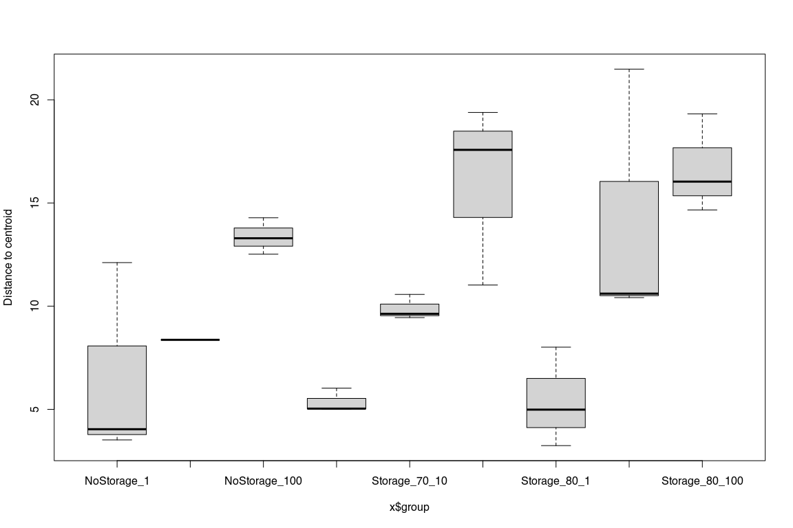

Dispersion
================
Sven Le Moine Bauer
2023-03-30

## Introduction

The following R code will describe the analysis leading to the making of
the dispersion figure in Supplementary data X.

## Loading and preparing the data.

Let’s start by loading the libraries and set up the working directory

``` r
library(phyloseq) # To play around with OTU tables
library(compositions) # Clr trasnformation
library(vegan) # Disåersion test

# Set directory to the directory of the script
setwd(dirname(rstudioapi::getActiveDocumentContext()$path))
```

Now let’s load the data.

``` r
OTUtable <- read.csv("Otutab.sorted.tsv", row.names=1, sep = "\t")
taxtable <- read.csv("assignments.csv", row.names = 1, sep = "\t")
Metatable <- read.csv("Metadata.csv", row.names = 1, sep = ",")
```

We need to make a couple of changes to the taxonomy table, namely
changing the Class Proteobacteria to Pseudomonadata, and also filling
the empty cells with “Unclassified_XXX”.

``` r
taxtable$Class[taxtable$Class == 'Proteobacteria'] <- 'Pseudomonadata'

for (i in 1:nrow(taxtable)){taxtable[i,] <- as.character(taxtable[i,])}
for (i in 1:nrow(taxtable)){
  if (taxtable[i,2] == ""){
    phylum <- paste("Unclassified_", taxtable[i,1], sep = "")
    taxtable[i, 2:7] <- phylum
  } else if (taxtable[i,3] == ""){
    class <- paste("Unclassified_", taxtable[i,2], sep = "")
    taxtable[i, 3:7] <- class
  } else if (taxtable[i,4] == ""){
    order <- paste("Unclassified_", taxtable[i,3], sep = "")
    taxtable[i, 4:7] <- order
  } else if (taxtable[i,5] == ""){
    family <- paste("Unclassified_", taxtable[i,4], sep = "")
    taxtable[i, 5:7] <- family
  } else if (taxtable[i,6] == ""){
    genus <- paste("Unclassified_", taxtable[i,5], sep = "")
    taxtable[i, 6:7] <- genus
  } else if (taxtable[i,7] == ""){
    species <- paste("Unclassified_", taxtable[i,6], sep = "")
    taxtable[i, 7] <- species
  }
}
rm(i, class, family, genus, order, phylum, species) # Some cleanup
```

Now we can make our phyloseq objects, remove the samples not needed for
this analysis, and remove the OTUs not assigned to Bacteria or Archaea
at the Domain level.

``` r
#Transform into matrixes the OTU and tax tables (needed for phyloseq)
OTUtable <- as.matrix(OTUtable)
taxtable <- as.matrix(taxtable)

#Make phyloseq objects
OTU = otu_table(OTUtable, taxa_are_rows = TRUE)
TAX = tax_table(taxtable)
samples = sample_data(Metatable)
Dataset <- phyloseq(OTU, TAX, samples)

# Remove the non Bacteria or Archaea
Dataset <- subset_taxa(Dataset, Domain %in% c("Archaea", "Bacteria"))

# Remove the blank, and sediment samples
Dataset <- prune_samples(!(sample_names(Dataset) == 'BLANK'), Dataset)
Dataset <- prune_samples(sample_data(Dataset)$Type == 'DNA', Dataset)

# We also need to remove the sample DNANoStora_10x_0 as the seqeuencing failed for that one (nearly no reads back).
Dataset <- prune_samples(!(sample_names(Dataset) == 'DNANoStora_10x_0'), Dataset)

# As we removed some samples it is possible that some OTUs are not present at all. Let's remove them.
keepTaxa = taxa_sums(Dataset) > 0
Dataset = prune_taxa(keepTaxa, Dataset)
```

## Plotting the dispersion

Let’s prepare the dataset first.

``` r
# Agglomeration at the family taxonomic level
Dataset_family <- tax_glom(Dataset, taxrank = "Family")

# Add +1 to each count to be able to use log ratios.
otu_table(Dataset_family) <- otu_table(Dataset_family) + 1

# clr transformation
otu_table(Dataset_family) <- otu_table(clr(otu_table(Dataset_family)), taxa_are_rows = TRUE)
```

And finally we can compute the distance matrix and the dispersion from
centroids for each group.

``` r
# The distance matrix using aithcison distance
clr_dist_matrix <- distance(Dataset_family, method = "euclidean")

# The dispersion from centroids
dispr <- betadisper(clr_dist_matrix, sample_data(Dataset_family)$DilTestGroup)

# And the plot.
boxplot(dispr)
```

<!-- -->
